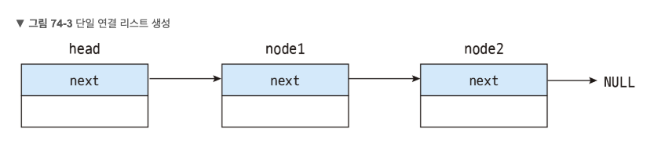

# Linked List

링크드리스트는 데이터를 주소를 통해 가지고 있는 특성을 지닌 자료구조입니다.

자신의 데이터와 다음 나올 데이터의 주소를 가지고 있으므로 저장된 자료의 갯수를 확인하기 위해서는 모든 주소를 거쳐야하는 단점이 있지만 자료를 양과 상관없이 효율적으로 저장할 수 있습니다.



- 머리 노드 (head node) : 단일 연결 리스트의 기준점이며 헤드(head)라고 부릅니다. 머리 노드는 첫번째 노드를 가리키는 용도이므로 데이터를 저장하지 않습니다.
- 노드 (node) : 단일 연결 리스트에서 데이터가 저장되는 실제 노드입니다.

이 두 종류의 노드는 역할만 다를 뿐 모두 같은 Node 객체를 사용합니다.

```js
function LinkedList (value, next) {
    this.value = (value === undefined ? null : value)
    this.next = (next == undefined ? null : next)
}

let head = null
let tmp = new LinkedList()
for(let i = 1 ; i <= 5 ; i++) {
    tmp.next = new LinkedList(i)
    if (!head) head = tmp
    tmp = tmp.next
}

let pivot = head
while(pivot) {
    console.log(pivot.value)
    pivot = pivot.next
}
```