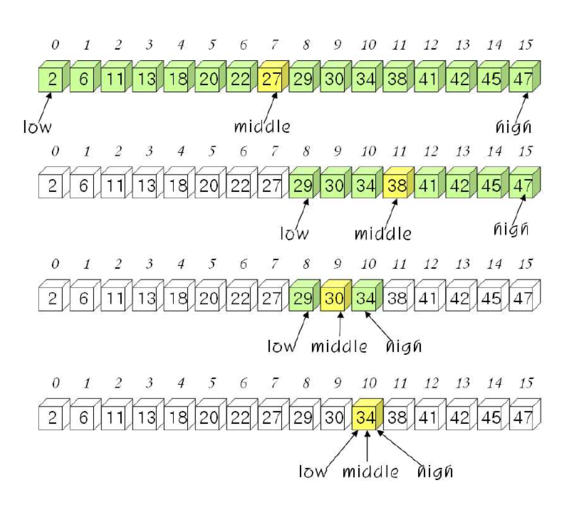
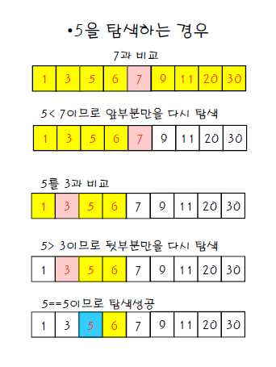

# 이진 탐색(Binary Search)

## 정의

정렬된 배열의 중앙에 위치한 원소와 비교 되풀이.

## 탐색 방법

배열의 중앙에 있는 값을 조사하여 찾고자 하는 항목이 왼쪽 도는 오른쪽 부분 배열에 있는지를 알아내어 탐색의 범위를 반으로 줄인다.

 

## 조건

**이진 탐색은 기본적으로 배열이 정렬되어있음을 원칙으로한다.** 

이진탐색을 구현할 땐 정렬된 배열의 중앙 인덱스의 값이 **어떤 값**과 **어떻게** 비교할 것인가가 중요하다.
이것은 주어진 문제에따라 달라지기때문에 문제를 읽고 이해한뒤에 `left`와 `right`가 어디로 향할 것인가를 먼저 생각하고 구현하는 것이 중요하다.

## 코드

1~10이 들어있는 배열에서 target을 찾는 로직이다.

```ts
binarySearch([1,2,3,4,5,6,7,8,9,10], 7)
function binarySearch (arr: number[], target: number) {
  let [left, right] = [0, arr.length]

  while(left < right) {
    const mid = Math.floor((left + right) / 2)

    if (arr[mid] < target) left = mid + 1
    else right = mid
  }

  console.log('left :: ', left, ', arr[left] :: ', arr[left])
  console.log('right :: ', right, ', arr[right] :: ', arr[right])
}

// left ::  6 , arr[left] ::  7
// right ::  6 , arr[right] ::  7
```