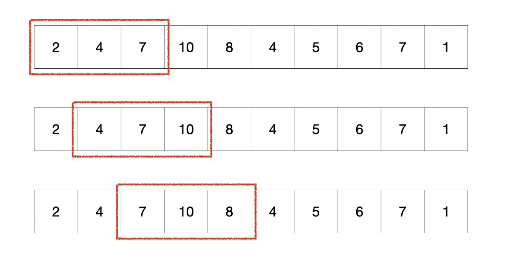

# Sliding Window 

슬라이딩 윈도우(sliding window) 알고리즘은 배열을 이용한 문제에서 자주 사용된다.

전체 배열에서 특정 연속된 범위를 계산할때 유용하게 사용되며 사용방법은 아래와 같다.



부모 배열의 서브 배열을 만들어서 조건에 맞게 서브 배열의 양쪽을 늘렸다 줄였다하는 방법으로 이런 방법을 통해 부모 배열의 전체를 서브 배열이 이동하면서 조건에 맞는 상태가 있는지 확인한다.

### 코드

아래 코드는 특정 자연수(N)이 넣으면 1부터 N까지의 자연수들 중에서 연속되는 합이 N이 되는 개수를 찾는 코드이다.

```js
const slidingwindow = (n) => {
    const slidingWindow = Array(n).fill().map((_,idx) => idx+1)
    let [start, end, cnt] = [0,1,0]
    while (start < end && end <= n) {
        const sum =  slidingWindow.slice(start,end).reduce((acc,cur) => acc + cur)
        sum === n && cnt++;
        sum >= n && start++;
        sum < n && end++;
    }
    return cnt;
}

console.log(slidingwindow(15)); // 4
```