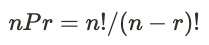
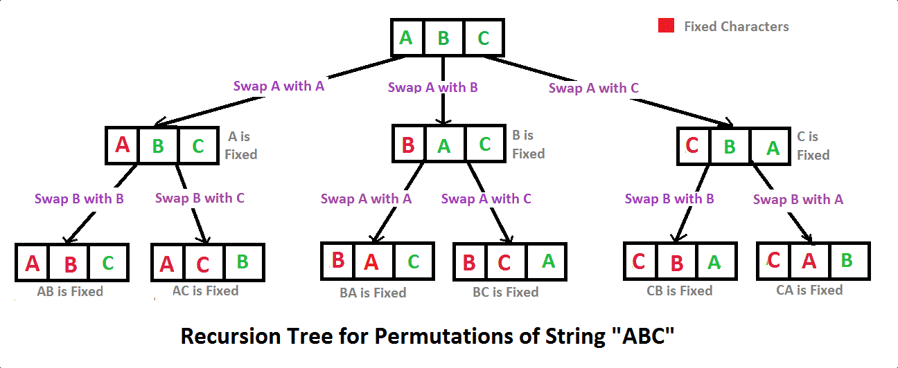

# 순열 (Permutation)

> 순열이란, 서로 다른 N개 중에서 R개를 선택하는 경우 (순서 중요👌 )



## swap을 이용한 순열 만들기



```javascript
/**
 *
 * @param {array} array
 * @param {number} deep
 * @param {number} target
 */
const permutation = (array, res = [], target = array.length, deep = 0) => {
	if (deep === target) {
		res.push(array.slice(0, target));
		return;
	}
	for (let index = deep; index < array.length; index++) {
		swap(array, deep, index);
		permutation(array, res, target, deep + 1);
		swap(array, deep, index);
	}
};

const swap = (array, a, b) => {
	let tmp = array[a];
	array[a] = array[b];
	array[b] = tmp;
};

const getPermutationList = (array, target) => {
	let res = [];
	permutation(array, res, target);
	return res;
};

const array = Array(3)
	.fill()
	.map((_, i) => i + 1);
console.log(getPermutationList(array));

/* --------------------------------------------------
[ 1, 2, 3 ]
[ 1, 3, 2 ]
[ 2, 1, 3 ]
[ 2, 3, 1 ]
[ 3, 2, 1 ]
[ 3, 1, 2 ]
*/
```
